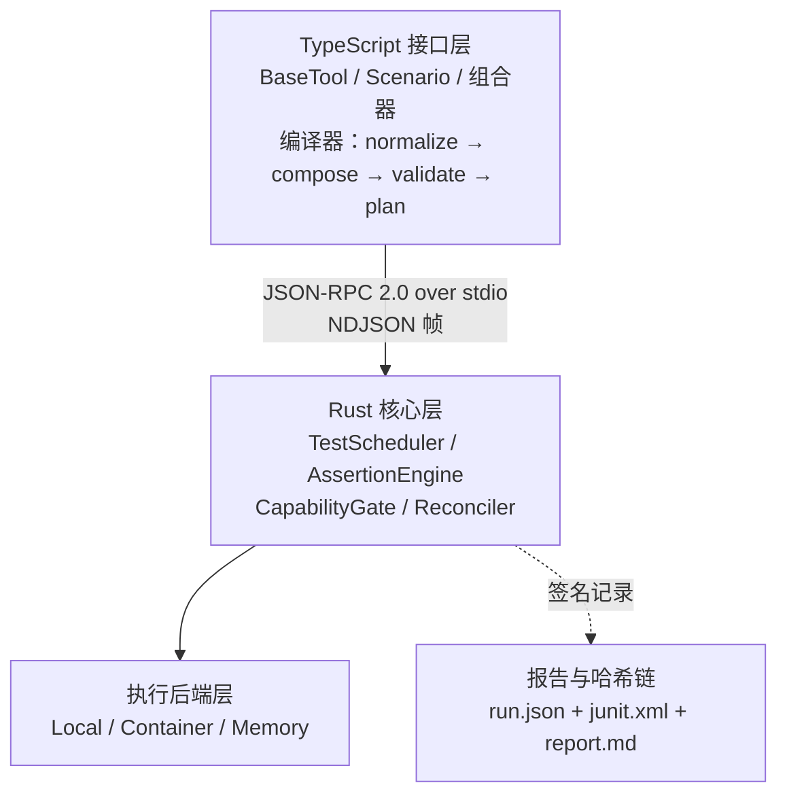
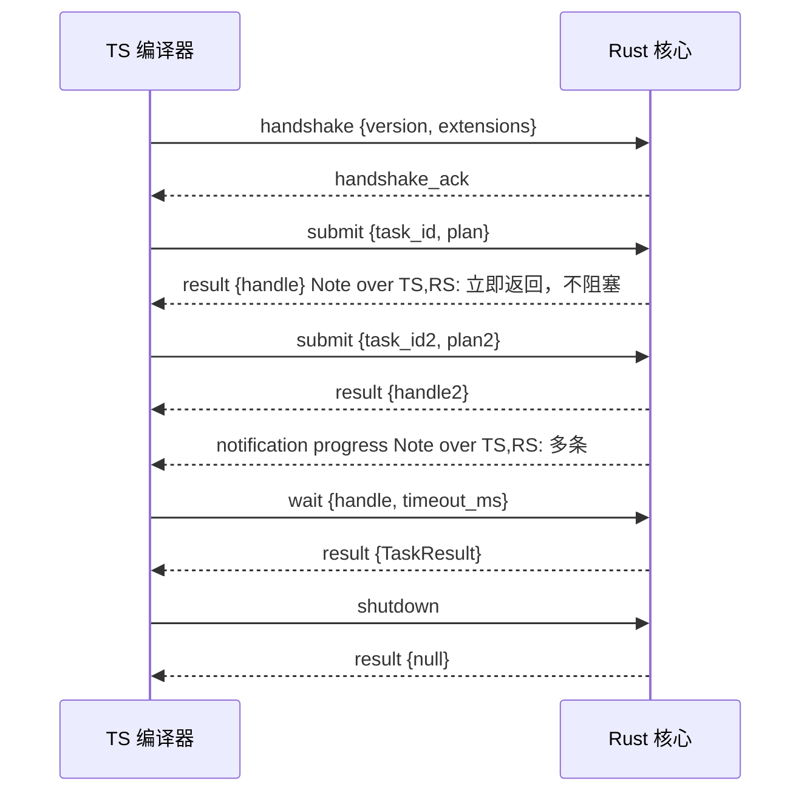

# dsh-testkit 重构设计（Rust 核心 + TypeScript DSL）

> **状态**：随 [RFC 0001](rfc/0001-rust-core-full-rewrite.md) 裁决。本文件写"怎么做"，**不写"做什么决定"**——决定与理由在 RFC 里，这里不重复、不另立。
>
> **标注约定**：每节标题后带一个标签——
> `沿用`＝沿用既有实现；`变更`＝替换或重写；`新增`＝原稿与本仓都没有；`待裁决`＝依赖 RFC §8 的待决事项（该节已给出解决方案与落点）。

---

## 0. 阅读约定与边界

### 0.1 与 RFC 的关系

| 问题 | 去哪找 |
|---|---|
| 为什么换语言、为什么推翻 D4、代价是什么 | [RFC 0001](rfc/0001-rust-core-full-rewrite.md) §3–§5 |
| 门槛值、测量方式、阶段退出条件 | [REWRITE-METRICS.md](REWRITE-METRICS.md) |
| 接口长什么样、协议怎么闭合、怎么迁移 | **本文件** |

### 0.2 分叉点（决定变了，哪些节跟着变）

| 若 RFC 裁决为 | 受影响的本文件章节 |
|---|---|
| 否掉 Rust（转方案 B） | §1.2 迁移映射、§3、§4、§7 全部作废；§2、§5、§8、§9 仍适用 |
| 否掉通用 DSL（保留 D4） | §2、§5 作废；§3、§4、§6–§9 仍适用 |
| 否掉完全重构 | §9.5 作废；其余全部适用（转为增量替换） |
| 取消链头锚定（Q2） | **已裁决为分层**：§7.5 收窄为"外部锚定只留接口"，§7.6 的本地锚定保留、指标 E4 保留 |
| 否掉输入源扩展（决定 10） | §10 作废；§2 / §9 不受影响 |

---

## 1. 目标架构

### 1.1 分层（新增）



**边界纪律（本设计最容易破的一条）**：

- **TS 侧不持有判定**。它可以拒绝（编译期校验失败），但**不可以**决定"这条断言过没过"。
- **Rust 侧不持有场景语义**。它执行 `ExecutionPlan`，不认识 `kind` 的业务含义。
- 两侧都不直接读对方的内部类型：跨语言契约只经由 **`ts-rs` 从 Rust 生成的类型**（[RFC 0001](rfc/0001-rust-core-full-rewrite.md) 决定 1）。

### 1.2 现状 → 目标 的对应关系（新增）

这是迁移工作的地图。左边是既有实现里**行为必须被提取**的模块，右边是它的新家：

| 现状（`src/`） | 目标 | 迁移性质 |
|---|---|---|
| `runtime/runner.ts`（35,876 字节，最大的文件） | Rust `TestExecutor` + TS 编排 | **变更**（拆开） |
| `runtime/assert.ts` | Rust `AssertionEngine` | **变更**（判定移出 TS） |
| `runtime/fixture.ts` + `isolation/**` | Rust `FixtureScope` + TS 注册面 | **变更**（保留逆序释放语义） |
| `executor/policy.ts`（22,310 字节，成本闸门） | **留在 TS** | **沿用**（它是安全边界，见 [SECURITY.md](../SECURITY.md)） |
| `kinds/*.ts`（12 个 driver） | TS `BaseTool` 实现 + Rust 执行 | **变更**（行为进 spec） |
| `cases/**`（loader / schema / registry） | **留在 TS** | **沿用**（`schema: 1` 不变） |
| `report/**`（json / junit / markdown / redact） | TS 报告渲染 + Rust 签名 | **变更** |
| `analysis/**`（causes / classify / repro） | Rust 归因引擎 | **变更** |
| `cli/**`（16 个子命令） | TS CLI，新增 1 个 | **沿用**（退出码见 §9.4） |
| `http.ts` + `client/**` | **留在 TS** | **沿用**（自建 HTTP bridge 已实测结案，不动） |

> 注：`src/http.ts` 与 `src/client/**` 对应 [ARCHITECTURE.md](ARCHITECTURE.md) §9.1 的 R1–R3、R7，全部已实测结案。**本设计不推翻已结案的决策**——这是原稿的一个典型错误（它把协议改成 JSON-RPC over stdio 却没说已结案的 bridge 怎么办）。

### 1.3 仓库结构（变更）

```text
dsh-testkit/
  crates/                      # 新增：Rust 核心
    scheduler/
    assertion/
    capability/
    executor/
    reconciler/
    protocol/                  # JSON-RPC 服务端 + ts-rs 类型导出
  src/                         # 保留：TS 接口层
    dsl/                       # 新增：BaseTool / Scenario / 组合器
    compiler/                  # 新增：normalize → compose → validate → plan
    rpc/                       # 新增：JSON-RPC 客户端
    kinds/                     # 收缩：driver 变成 BaseTool 实现
    cases/                     # 沿用
    executor/policy.ts         # 沿用（安全边界）
    http.ts, client/           # 沿用
  types/generated/             # 新增：ts-rs 生成的 TS 类型（禁止手改）
  spec/                        # 新增：行为规格（重构期唯一历史）
    cases/
    schema/
  archive/legacy/              # 重构期：旧实现归档，仅用于对拍；阶段 3 删除
  lib/                         # 沿用：TS 编译产物 + Rust 产物
```

---

## 2. 概念模型（新增）

### 2.1 三个构件

```text
BaseTool（基础测试工具 / 原子）
    │ 组合
SmallScenario（一个测试点）
    │ 组合 + 包含
LargeScenario（一个测试域）
```

| 构件 | 是什么 | 对等物 |
|---|---|---|
| BaseTool | 最小的可复用干预 + 取证单元，**原子、不可再分** | 今天 `kinds/*.ts` 里的一个动作分支 |
| SmallScenario | 一个测试点：可独立 pass/fail/skip | 今天的 `cases/TK-XXXX.yaml` |
| LargeScenario | 一个测试域：包含若干小类，可选择共享宿主 | 今天不存在的概念 |

**两种关系不能混用**（原稿混淆过）：

- **组合（compose）**：由下层拼出上层，是**构造过程**，编译期完成。
- **包含（contain）**：大类里挂着小类，是**组织结构**，影响报告聚合与共享宿主，不影响执行顺序。

### 2.2 既有 12 个 kind 到 BaseTool 的映射（回答 RFC §8 Q6）

这是决定 5（推翻 D4）的**可行性前提**。逐 kind 列出原子拆分与风险：

| kind | 拆成的 BaseTool | 风险 |
|---|---|---|
| `tool` | `register-tool`、`call-tool` | 无 |
| `prompt` | `assemble-prompt`、`inject-section` | 无 |
| `llm` | `intercept-llm-stream` | 无（零上游请求） |
| `interaction` | `answer-question`、`answer-approval` | 无 |
| `session` | `run-command`、`flush-session`、`goal-op`、`observe-events` | 无 |
| `resource` | `fake-provider` | 无 |
| `agent` | `spawn-agent`（`one-shot` / `teammate`） | **`cost: high`**，真调模型；RFC §7 停止线 4 的候选 |
| `ui` | `load-client-bundle` | 无（纯离线） |
| `shell` | `run-argv` | 无 |
| `file` | `read-file`、`glob-file`、`search-file` | 无（纯离线） |
| `fs` | `fs-resolve/stat/read/list/write/edit` | 无（需 `fs` 能力） |
| `compaction` | `compaction-if-needed`、`compaction-region`、`compaction-now`、`compaction-inspect`、`compaction-dump` | ⚠️ `now` 需真实 agent 上下文 → 由 **`availableIn` 上下文约束**表达（见下），**不构成逃生舱** |

> **结论（RFC §8 Q6 的解法）**：**12 个 kind 全部落进 BaseTool**，不需要任何"逃生舱"。
> 做法是把"可用上下文"提升为 BaseTool 的**一等声明**——约束是静态可判的，所以 `validate` 能在**计划期**就决定 skip 还是报错，剪枝依据仍是完整的声明式图。

```rust
pub trait BaseTool: Send + Sync {
    fn kind(&self) -> ToolKind;
    /// 该工具在什么上下文中可用。缺省 = 任何上下文。
    /// 这是**声明**，不是运行期探测 —— 所以 validate 能提前判定。
    fn available_in(&self) -> ContextSpec { ContextSpec::Any }
}

pub enum ContextSpec {
    Any,
    /// 需要真实 agent 上下文（例如 compaction 的 `now`：需要 runMaintenance）
    RequiresAgentContext,
    /// 只允许作用于自身创建的隔离会话（例如 compaction 的 region / now）
    IsolatedSessionOnly,
    All(Vec<ContextSpec>),
}
```

`compaction` 的五个动作各自带上下文约束：`compaction-if-needed` / `compaction-region` → `IsolatedSessionOnly`（会真的改写会话状态），`compaction-now` → `RequiresAgentContext`（需要 `ManualCompactAgentContext.runMaintenance`，隔离会话没有，见 `src/kinds/compaction.ts:320-342`），`compaction-inspect` / `compaction-dump` → `Any`（纯读）。由 `validate` 与场景声明的上下文求交——不满足**在计划期**就得出 `Skip` 或报错，而不是跑起来才发现。

### 2.3 与小类/大类的共享宿主

- **小类场景默认不共享宿主**（沿用今天的纪律：`parallel` 缺省 `exclusive`，见 [SCENARIO-SPEC.md](SCENARIO-SPEC.md)）。
- **大类场景可选共享宿主**，但必须在报告里标 `sharedContext: true/false`——否则"这条失败是不是上一条污染的"无法判定。
- 共享宿主时，**每个小类前后各做一次**状态快照并比对差异（不是只在跨小类边界）：小类内部同样可能污染，而快照成本 = 一次取证 diff，远低于"污染后定位到哪一步"的成本。
  - **降级条件**：若快照开销超过该用例耗时的 20%（由 D1 类基准测得），降为"仅跨小类边界"，并在报告里标 `snapshot: boundary-only`——**降级必须可见**。
- 这套机制**沿用**既有 `src/isolation/probes.ts`（端口/进程异步探针，探不到标 `unknown`）与 `cleanup` 记录。

---

## 3. Rust 核心接口（变更）

### 3.1 设计约束

| 约束 | 说明 | 为什么 |
|---|---|---|
| 对象安全 | 所有需动态分发的 trait 必须 dyn 兼容；异步方法用 `#[async_trait]` | 12 个 kind 要作为插件式实现注册进来 |
| 线程安全 | 跨线程共享的 trait 必须 `Send + Sync` | 调度器会被多线程运行时持有 |
| **内部可变性必须显式** | `register_*` 一类方法的 `&self` 后面是 `RwLock`/`Mutex`，注释与文档必须写明锁语义与重入行为 | 原稿写 `fn register(&self, ...)` 却不说明这一点，读者会以为它是无状态 |
| 序列化 | 协议消息用 `#[serde(tag = "type")]` + `#[non_exhaustive]` | 未知 tag 显式失败 → 版本不匹配能被检出，而不是静默降级 |
| 错误 | 断言失败**不是** `Result::Err`，是正常结果 | 否则 `?` 会把"失败"和"工具坏了"混在一起——这正是 [ARCHITECTURE.md](ARCHITECTURE.md) §1 要避免的 |

### 3.2 TestScheduler

```rust
#[async_trait]
pub trait TestScheduler: Send + Sync {
    async fn submit(&self, task: TestTask) -> Result<TaskHandle, SchedulerError>;
    async fn wait(&self, handle: &TaskHandle) -> Result<TaskResult, SchedulerError>;
    async fn cancel(&self, handle: &TaskHandle) -> Result<(), SchedulerError>;
    fn status(&self) -> SchedulerStatus;
    async fn shutdown(&self) -> Result<(), SchedulerError>;
}
```

契约要点（修正原稿的三处含糊）：

1. `submit` **立即返回句柄，不阻塞**；结果只能经 `wait` 或通知获得——与 §4.3 的方法表**严格一致**（原稿的 §7.7 交互序列让 `submit` 直接返回 `TaskResult`，与 §6.2 矛盾）。
2. `TaskHandle` = `TaskId`（UUID v7，可按时间排序）+ 原子状态标志。**句柄可被多次 `wait`**（第二次起立即返回）。
3. `cancel` 幂等；对已终态的句柄返回 `Ok(())`。
4. `shutdown` 可重复调用；在途任务被取消并按 §6.2 逆序释放。

### 3.3 AssertionEngine

```rust
pub trait AssertionEngine: Send + Sync {
    fn assert(&self, ctx: &AssertionContext, spec: &AssertionSpec) -> AssertionOutcome;
    fn assert_all(&self, ctx: &AssertionContext, specs: &[AssertionSpec]) -> AggregateAssertionResult;
    /// `&self` 背后是 `RwLock<HashMap<..>>`：写锁只在注册期持有，判定期只持读锁。
    /// 重入注册会返回 `AssertionError::AlreadyRegistered`，不静默覆盖。
    fn register(&self, name: &str, evaluator: Box<dyn AssertionEvaluator>) -> Result<(), AssertionError>;
    fn registered_names(&self) -> Vec<String>;
}

pub trait AssertionEvaluator: Send + Sync {
    fn evaluate(&self, actual: &serde_json::Value, expected: &serde_json::Value,
                meta: &AssertionMetadata) -> AssertionOutcome;
}
```

`AssertionOutcome` **四态**（原稿只有四态但没写清 `Inconclusive` 的用途）：

```rust
pub enum AssertionOutcome {
    Passed { details: Option<serde_json::Value> },
    Failed { expected: serde_json::Value, actual: serde_json::Value, diff: String },
    Skipped { reason: String },
    /// 非确定性导致无法判定（例如跨平台浮点差异超过容差且不可归因）。
    /// 它**不计入 passed**，也不计入 failed——但必须计入报告的 `inconclusive` 计数，
    /// 并且**在严格档下视为失败**（见 §8.4）。
    Inconclusive { reason: String },
}
```

> 断言词集合**沿用**今天的 16 个（14 个求值词 `is` / `isNot` / `notIs` / `exists` / `notExists` / `contains` / `notContains` / `matches` / `atLeast` / `atMost` / `length` / `lengthAtLeast` / `lengthAtMost` / `throws`，加 `soft` 修饰与 `ref` 引用解析），语义以 [SCENARIO-SPEC.md](SCENARIO-SPEC.md) 为准。**不新增断言词**——那会同时改动 `cases` schema 语义（需另立 RFC）。
>
> **2026-10-11 勘误（阶段 0 实测）**：原文写"17 个"却只列 16 项，是自相矛盾的计数。实测四处源码数组（`src/runtime/assert.ts:22-37`、`src/cases/schema.ts:50-65`、`src/registry/loader.ts:91-106`、`src/analysis/causes.ts:89-104`）**一律 14 个**（`notIs` / `notContains` / `notExists` 作为独立键计入），加 `soft` / `ref` 为 **16**。`README.md` 与 `docs/FEATURES.md` 的"17 个"同样是错的（后者自己只列 13 个）。**阶段 1 以 16 为实现基准**，并须为断言词计数补一条守卫（当前无任何守卫覆盖它）。

### 3.4 CapabilityGate

```rust
pub trait CapabilityGate: Send + Sync {
    fn probe(&self, capability: &CapabilityId) -> CapabilityState;
    fn probe_all(&self, capabilities: &[CapabilityId]) -> CapabilityMap;
    fn gate(&self, capability: &CapabilityId, policy: GatePolicy) -> GateDecision;
    fn register_detector(&self, capability: CapabilityId,
                         detector: Box<dyn CapabilityDetector>) -> Result<(), GateError>;
    fn refresh(&self) -> Result<(), GateError>;
}

pub enum CapabilityState { Available { details: Option<Value> }, Unavailable { reason: String }, Unknown }
pub enum GateDecision { Proceed, Skip { reason: String }, Fail { reason: String }, Degrade { fallback: String } }
```

契约要点（修正原稿的**语义冲突**）：

1. **探测器注册后立即执行一次并缓存**，随后 `probe` 返回缓存。
2. `refresh` 是**原子替换**：刷新期间 `probe` 返回旧值，不返回半新半旧。
3. 探测超时 **500ms** 视为 `Unavailable`（不是 `Unknown`）——超时是一个可归因的事实。
4. **`Unknown` 与缺能力不是一回事**：`Unknown` 在严格档下按 `Fail` 处理（宁可红，不假装通过），非严格档按 `Skip` 处理。这是既有 `src/isolation/probes.ts` "探不到标 unknown"纪律的延续。
5. **门控与退出码的关系统一在这里定义**（原稿四处打架）：

| 场景 | 决策 | 退出码 |
|---|---|---|
| 冻结档 / 发布档 缺能力 | `Skip` | `0`（跳过不是失败，沿用 `src/cli/exit.ts` 的既有语义） |
| 严格档下**必需**能力缺失且场景声明 `requires: mandatory` | `Fail` | `7` |
| 非严格档缺能力 | `Degrade`（有 fallback）或 `Skip` | `0` |
| 协议不匹配 | 不经门控，握手阶段拒绝 | `6` |

> 原稿的 `onUnsupported: 'exit-4'` 与 `missingCapability: 'skip'` 并存，且新增退出码 `7` 又叫"能力门控失败"——三者互斥。本设计给出唯一裁决表，**版本不兼容归 `6`（协议）/ `3`（环境），归 `7` 的只有"必需能力缺失"**。

### 3.5 TestExecutor 与 ReportAggregator

```rust
#[async_trait]
pub trait TestExecutor: Send + Sync {
    async fn execute(&self, task: &TestTask) -> Result<ExecutionTrace, ExecutionError>;
}

pub trait ReportAggregator: Send + Sync {
    fn aggregate(&self, traces: &[ExecutionTrace],
                 assertions: &[AggregateAssertionResult]) -> TestReport;
    fn export(&self, report: &TestReport, format: ReportFormat) -> Result<Vec<u8>, ReportError>;
}
```

**报告字段的兼容要求**：`TestReport` 序列化后必须能填出既有 `schemas/run-report.schema.json` 的**全部既有字段**（`runId` / `startedAt` / `finishedAt` / `casesDir` / `dshVersion` / `platform` / `totals` / `cases[]` / `policySnapshot` / `selection` / `execution` / `redaction`）。逐字段的等价关系见 §9.3。

### 3.6 Reconciler（对拍器）

```rust
pub trait Reconciler: Send + Sync {
    fn compare(&self, legacy: &ExecutionTrace, new: &ExecutionTrace) -> ReconciliationReport;
}

pub struct ReconciliationReport {
    pub matches: Vec<FieldMatch>,
    pub mismatches: Vec<FieldMismatch>,   // 每条带 case_id + 字段路径 + 等价关系
    pub normalized_fields: Vec<String>,   // 本次用到的归一化规则（可审计）
}
```

**规则**（取代原稿笼统的"逐字节"）：

- 每个字段的等价关系**在 spec schema 里逐字段声明**（§9.3），对拍器按声明比对。
- 没被声明的字段 **不比对**，但必须出现在 `normalized_fields` 或 `uncompared_fields` 里——**"没比"必须是可见的**，否则对拍器的盲区就是重构的盲区。
- 对拍器自身**必须有反向测试**：注入已知差异，验证它能检出（[REWRITE-METRICS.md](REWRITE-METRICS.md) A5）。

---

## 4. 通信协议（变更，闭合版）

> 原稿的协议定义**不闭合**：(a) 握手消息 `ProtocolHandshake` 不在 `ProtocolMessage` 枚举里；(b) 方法表说 `submit` 返回 `TaskHandle`，交互序列却说返回 `TaskResult`。本节逐条修掉。
>
> **2026-10-11 阶段 1 又补两处（都是实现时暴露的，不是纸面推演）**：
> **(c) 方法表里有 `wait`，消息集里却没有 `Wait` 变体** —— 照抄本节会让协议**无法表达"先提交 N 个再一起等"**（那正是 `wait` 存在的理由）。
> **(d) 消息集里没有任何成功应答（result）变体**，而方法表承诺 9 个方法有返回 —— 照抄本节的话，服务端**物理上回不出** `TaskHandle` / `TaskResult` / `TaskStatus`（`frame::write_frame` 只接受 `ProtocolMessage`，这把缺口变成了**编译期事实**，是 `rust-scheduler` 在做 TS 客户端时发现的）。
> 补上后的枚举共 **15 个 tag**，`all_tags()` 的契约测试把它钉住（14 → 15 的变更必须显式改那个数字）。

### 4.1 传输（沿用原稿的结论）

**`stdio` + JSON-RPC 2.0，帧格式为换行分隔 JSON（NDJSON）。**

理由：零网络配置；天然进程隔离；与 LSP / MCP 生态一致。**但这不替代既有的 host↔client HTTP bridge**——那条通道已实测结案（[ARCHITECTURE.md](ARCHITECTURE.md) §9.1 R1–R3），服务于浏览器侧；本协议服务于 **TS 编译器 ↔ Rust 核心**。两者并存，互不替代。

### 4.2 消息集（修正：握手纳入枚举 + 补 `wait` 与 `result`）

```rust
#[derive(Debug, Clone, Serialize, Deserialize)]
#[serde(tag = "type", rename_all = "snake_case")]
#[non_exhaustive]
pub enum ProtocolMessage {
    // 握手（修正 (a)：必须在枚举内，否则"第一帧"是未定义类型）
    Handshake(ProtocolHandshake),
    HandshakeAck(HandshakeAck),

    // C → S
    Submit(SubmitParams),
    Cancel(CancelParams),
    Wait(WaitParams),                  // 修正 (c)：方法表有 wait，消息集原来漏了它
    Query(QueryParams),
    RegisterAssertion(RegisterAssertionParams),
    RegisterCapability(RegisterCapabilityParams),
    RefreshCapabilities(RefreshParams),
    Shutdown(ShutdownParams),

    // S → C
    Progress(ProgressNotification),
    CapabilityChanged(CapabilityChangedNotification),
    Trace(TraceNotification),
    Result(ResultParams),              // 修正 (d)：成功应答。{"type":"result","id":N,"result":…}

    RpcError(RpcError),
}
```

**修正 (d) 的形状**（与 JSON-RPC 2.0 一致，应答不重复方法名，靠 `id` 配对）：

```rust
pub struct ResultParams {
    pub id: u32,                       // 与请求配对；单调递增由客户端负责
    pub result: Option<serde_json::Value>,  // None 有确切含义，见下
}
```

两条**可验证的**约束（不是口味）：

1. **params 必须平铺在请求帧顶层，不能嵌在 `params:` 键下** —— 否则 `read_frame` 解析 `SubmitParams` 会因缺 `task_id` 直接失败。平铺是 wire 兼容的**唯一**选择。
2. **请求里带 `id` 不会破坏既有读取器** —— 整个 `crates/protocol` **没有一处 `deny_unknown_fields`**，serde 默认忽略未知字段。
3. `RpcError` 增加 **可选** `id`：不是每个错误都对应一个请求（握手前的 `-32001` 就没有 id 可回）。
4. **`result: null` 有确切含义**：`wait` 到点而任务**仍未终结**。`TaskResult` 里没有"还没好"态，用 JSON 的 `null` 表达"暂时无结果"，**不编造** `Cancelled` / `Skipped`（那是伪造语义）。

### 4.3 方法表（修正：`submit` 只返回句柄）

| 方法 | 方向 | 参数 | 返回 | 幂等 |
|---|---|---|---|---|
| `handshake` | C→S | `ProtocolHandshake` | `HandshakeAck` | 是 |
| `submit` | C→S | `SubmitParams` | **`TaskHandle`** | 否 |
| `wait` | C→S | `WaitParams{handle,timeout_ms}` | `TaskResult` | 是 |
| `cancel` | C→S | `CancelParams` | `()` | 是 |
| `query` | C→S | `QueryParams` | `TaskStatus` | 是 |
| `register_assertion` | C→S | `RegisterAssertionParams` | `()` | 否（重名报错） |
| `register_capability` | C→S | `RegisterCapabilityParams` | `()` | 否（重名报错） |
| `refresh_capabilities` | C→S | `RefreshParams` | `CapabilityMap` | 是 |
| `shutdown` | C→S | `ShutdownParams` | `()` | 是 |

**新增 `wait` 方法**：原稿只有 `submit` 且交互序列假设它同步返回结果——那等于把"提交"和"等待"绑死，无法表达"先提交 N 个任务再一起等"。`wait` 是这套设计能表达并发的**必要**方法。

### 4.4 握手（沿用 + 补一条）

1. 客户端启动 Rust 进程后**第一帧必须是 `Handshake`**。
2. 服务端验证：主版本相同，且次版本 服务端 ≥ 客户端。
3. 服务端返回 `HandshakeAck`；此后才接受其它方法。
4. **补**：握手前的任何其它帧一律回 `RpcError{code:-32001}` 并关闭连接（不静默忽略——静默会让"协议不匹配"表现为"方法找不到"）。

### 4.5 错误码

标准 JSON-RPC：`-32700` Parse / `-32600` Invalid Request / `-32601` Method not found / `-32602` Invalid params / `-32603` Internal。

| 自定义码 | 含义 | 映射到退出码 |
|---|---|---|
| `-32001` | 版本不兼容 | `6` |
| `-32002` | 能力不可用 | `0`（skip）或 `7`（必需） |
| `-32003` | 任务已存在 | `2`（用法） |
| `-32004` | 任务不存在 | `2`（用法） |
| `-32005` | 执行超时 | `1`（被测对象失败） |
| `-32006` | 需要审批 | `0`（skip + 理由），**不是** `5` |
| `-32007` | **注册名已存在** | `2`（用法） |

> `-32006` 刻意**不**映射到 `5`：`5` 在本仓是保留号，且"需要审批"在本仓是"未获放权 → 如实 skip"（沿用 `--allow-model` 纪律）。
>
> **`-32007` 是 1.0.0 补的一格**（`rust-scheduler` 在实现 TS 客户端时发现并交回裁决）：`register_assertion` / `register_capability` 的**重入必须报错、不静默覆盖**，而 `crates/assertion` 与 `crates/capability` **都已经返回** `AlreadyRegistered`——本表里却没有任何一格对得上它：`-32602` 说的是"参数格式错"、`-32003` 说的是"**任务**已存在"，把"注册名重名"塞进任何一格都是**语义错配**。**一端有明确语义、另一端无对应码，就是契约缺一格。**
>
> 这一格的落地过程本身是个证据：加完 Rust 侧的变体后，TS 侧 `src/rpc/errors.ts` 的
> `satisfies Record<RpcErrorCode, number>` **当场变成编译错误**（`Property 'already_registered' is missing`）。
> 也就是说跨语言契约的漏项**不靠人记得**，靠类型系统兜住。

### 4.6 交互序列（修正：与 §4.3 一致）



---

## 5. TypeScript DSL 与编译器（新增）

### 5.1 组合器语义表

决定 5 引入七个组合器。语义必须**逐个可判定**，否则编译器无法校验：

| 组合器 | 语义 | 编译期可见性 | 与既有机制的关系 |
|---|---|---|---|
| `seq(...nodes)` | 顺序执行，前一个完成后启动下一个 | 边：`n_i → n_{i+1}` | 等于今天的步骤顺序 |
| `parallel(...nodes)` | 并发启动，**全部完成**才继续 | 边：同层并行；需资源锁校验 | 等于今天 `parallel: safe` 的扩展 |
| `when(cond, then, else?)` | 按条件选一支；`cond` 必须是**编译期可判定的**（能力/版本/配置），不接受运行期随机 | 两支都进图，运行期剪一支 | 新增 |
| `retry(node, {times, backoff})` | 失败重试至多次；**只对 `Inconclusive` 与 `env` 归因重试**，`product_bug` 不重试 | 展开为 `times` 个节点 + 汇聚 | 等同于今天的 `runtime.repeat`，但可作用于单点 |
| `matrix(cases, node)` | 参数化展开为 `cases` 个实例 | 实例数与参数进 `metadata` | 等同于今天的 `registry/templates` + `with:` |
| `setup(before, node, after)` | 前置/后置；`after` **保证执行**（即使 `node` 失败） | 边 + 释放点 | 等同于今天的 `setup` + `cleanup` |
| `dependsOn(graph)` | 显式依赖图；**禁止成环** | 拓扑排序，环 → 编译期报错 | 新增 |

**硬规则**（编译器强制，不只是文档约定）：

1. 工具是**叶子**节点，场景是**复合**节点——叶子不可包含场景。
2. 场景嵌套**不超过三层**（超过则报错，理由：嵌套深度直接决定子图剪枝的可控性）。
3. 小类场景**不共享宿主**；要共享必须在 `LargeScenario` 里显式声明，且报告标 `sharedContext: true`。
4. 组合器**只描述结构，不执行**——它们编译成 `ExecutionPlan` 的 `nodes` 与 `edges`，没有副作用。

### 5.2 编译四阶段

```text
Scenario DSL
  → normalize   展开参数、解析引用、展开 use: 片段（纯文本替换，不做语义推断）
  → compose     递归展开场景为工具节点与边
  → validate    能力 / 版本 / 依赖环 / 资源冲突 / 生命周期 五项检查
  → plan        拓扑排序 → ExecutionPlan（JSON）→ 交给 Rust
```

**`normalize` 的纪律沿用今天的 step registry**：`use:` 的展开是**纯文本替换**，不做语义推断；片段语义变化必须 `registry` 版本 +1（见 [GOVERNANCE.md](GOVERNANCE.md) §2）。这条纪律**不允许**因为引入组合器而放松。

### 5.3 四层防御（补设计——原稿只在总结章提到，正文没有）

原稿 §16.7 把"四层防御"当成已设计的东西在总结里陈述。它当时没有设计。这里补上：

| 层 | 在哪 | 拦什么 | 拦不住时 | 错误码 |
|---|---|---|---|---|
| 第 1 层 | TS 类型系统 | 类型错误、资源类型不匹配、生命周期错用 | 编译不过 | TS 编译错误 |
| 第 2 层 | 编译器 `validate` | 依赖环、能力缺失、场景包含约束、嵌套超三层 | 拒绝生成 plan | `2`（用法） |
| 第 3 层 | plan 校验（运行前） | 能力探测、资源锁冲突、审批点缺失 | 拒绝启动 | `7` 或 `0`（按 §3.4） |
| 第 4 层 | 执行器 | 隔离、快照、回滚、可信度标记 | 运行期失败并归因 | `1` |

**第 3 层为什么必须存在**：第 1、2 层都在 TS 里，而"这台机器现在有没有 `subprocess` 能力"是**运行期事实**——类型系统看不到它。这正是 §1.1 "TS 侧不持有判定"与"TS 侧可以拒绝"的分界线。

### 5.4 plan 校验与资源锁（补设计）

`ExecutionPlan` 在启动前做两项**运行期**检查：

1. **能力探测前置**：把 plan 里所有节点的 `requires` 取并集，一次性 `probe_all`；缺失且为必需者 → 按 §3.4 决策，**不进入执行**（避免跑一半才发现）。
2. **资源锁**：声明式资源（会话、临时目录、端口、全局注册表）在 plan 里登记；`parallel` 分支若写同一资源 → 编译期报冲突（`F3` 指标）；跨进程的资源冲突 → plan 校验期报。

```rust
pub struct ExecutionPlan {
    pub nodes: Vec<ToolNode>,
    pub edges: Vec<Edge>,
    pub metadata: ScenarioMetadata,
    /// 新增：声明式资源与锁，用于 F3 资源冲突检出
    pub resources: Vec<ResourceClaim>,
}

pub struct ToolNode {
    pub node_id: String,
    pub tool_kind: String,
    pub input: serde_json::Value,
    pub gate: Option<GateSpec>,
    pub retry: Option<RetrySpec>,
    pub timeout_ms: Option<u64>,
    /// 新增：该节点要求的可信度下限；低于它则拒绝进入发布门槛判定
    pub min_confidence: Option<ConfidenceLevel>,
}
```

**直接写 `ExecutionPlan` JSON 的入口**：允许，但必须标 `unsafe`，且产出的结果可信度降为 `Static`——它绕过了第 1、2 层，不能与正常路径的结果同等采信（原稿缺点 6 的正确处置）。

---

## 6. 执行模型（变更）

### 6.1 编译后执行

```text
Scenario DSL
   ↓ normalize（展开参数、解析引用、展开 use: 片段）
   ↓ compose（递归展开为工具节点与边）
   ↓ validate（能力 / 版本 / 依赖环 / 资源冲突 / 嵌套深度）
   ↓ plan（拓扑排序 → ExecutionPlan）
   ↓ execute（Rust 按 plan 执行）
   ↓ report（按小类 / 大类 / 层级聚合）
```

提前编译的四个收益（**沿用**原稿的判断，它们是对的）：缺能力在启动前就 skip、总算力与审批点可预估、增量执行只跑受影响子图、报告天然按小类/大类聚合。

### 6.2 隔离与回滚（沿用既有纪律）

既有纪律在 [ARCHITECTURE.md](ARCHITECTURE.md) §8 的 D5 与 [SCENARIO-SPEC.md](SCENARIO-SPEC.md) 里：**所有干预必须经夹具登记入口（`Fixture.add()`）登记，逆序释放**。本设计**逐条沿用**，不放松：

1. 任何注册（工具 / 命令 / 事件监听 / 假 provider）必须走登记，登记的 disposer 进释放栈。
2. 释放**逆序**执行；释放失败**不静默**——记进 `cleanup.released` / `cleanup.leftovers`（既有字段）。
3. 步骤级 `cleanup.releaseNotes` 在本步结束就释放，不等整条场景（既有能力）。
4. 残留探测**沿用** `src/isolation/probes.ts`：端口/进程异步探针，**探不到标 `unknown`**，绝不标"干净"。
5. `compaction` 一类会**真的改写状态**的动作，只允许作用在自己创建的隔离会话上（既有安全约定）。

> Rust 侧承担的是"释放栈的**正确性**"（逆序、幂等、失败可见）；"登记了什么"仍由 TS 侧驱动提供。这条分工与 §1.1 的边界纪律一致。

### 6.3 并发模型（[RFC 0001](rfc/0001-rust-core-full-rewrite.md) §8 Q1 的解法）

**问题的实质不是"能不能同时做到"，而是把并发放在了哪一层。** 让"多线程异步运行时"与"判定"共处一层，就只能靠实测祈祷。所以方案是把并发**限制在 I/O 上**：

| 层 | 策略 | 为什么 |
|---|---|---|
| I/O（网络 / 文件 / 子进程） | **允许真并发**（多线程异步运行时） | 它只影响"多久拿到结果"，不影响"看到什么顺序" |
| **判定路径**（事件进入断言、调度决策、报告写入） | **单线程 + 显式事件队列**：出队顺序由「种子 + 显式优先级」决定，**不由线程池抢占决定** | 同种子 ⇒ 同顺序。这是 C1 的**结构**保证 |
| 用例之间 | **多进程并行**（每用例一进程，`parallel: safe` 才允许） | 进程隔离让"单条用例的确定性"与"整体吞吐"解耦 |
| 共享宿主的大类 | **串行**（`exclusive`） | 沿用既有默认：不认识的东西不并发 |
| 资源 | 声明式锁（§5.4） | 跨进程冲突在 plan 校验期就报，而不是跑出 flaky |

**三条使能措施**：

1. **事件序列可重放**：所有进入判定路径的事件带 `seq`，运行记录保留完整序列；重放按记录的 `seq` 注入。
2. **C1 的判据升级为「事件序列哈希相同」**：比"结果相同"更强，且**更好定位**——不一致时直接报"第一个 `seq` 分叉的位置"，而不是只说"两条断言结果不同"。
3. **不可确定者必须移出判定路径**：任何无法确定化的输入（OS 级 I/O 完成顺序等）**只允许影响已标记为"不参与判定"的字段**。这是**约束**，不是期望。

**验证方式**：`loom` 用来验证**调度器实现**（枚举线程交错，证明队列出队顺序与线程时序无关），而不是验证整个系统——后者穷举不完。

> **结论**：相容，且该结论**不依赖任何实测数字**，它是架构约束的推论。实测只用来验证"实现符合约束"。
> **明确不做**：不追求"单进程内多线程跑一条用例"——那会让顺序变成调度器的函数，C1 必然失守。

### 6.4 确定性保障（修正：按来源分类，并给出可执行的纪律）

原稿缺点 3 说"Rust 能消除数据竞争但不能消除所有非确定性"，方向对，但没落到纪律上。逐来源处置：

| 来源 | 可消除？ | 处置 |
|---|---|---|
| OS 调度顺序 | 否 | 用例内单线程 + 事件顺序显式化；顺序敏感处用显式同步点 |
| 文件系统枚举顺序 | **是** | 一律排序后比对（既有对拍纪律的延续） |
| 网络时序 | **是** | 沿用既有假 provider（`resource` driver 零真实网络） |
| 第三方进程（容器 / 宿主） | 部分 | 版本锁定 + 判定超时；超时归因 `env` 而非 `product_bug` |
| 跨平台浮点 | 部分 | 容差 1e-9；**对拍要求同平台**，跨平台只比"归一化后一致" |
| **哈希迭代顺序** | **是** | ⚠️ **这是换成 Rust 后的新风险**：`std::collections::HashMap` 默认用随机种子（`RandomState`），迭代顺序**每次运行都不同** |

**由此产生一条硬纪律**（原稿完全没提，而它会让"Rust 更确定"的论断当场失效）：

> **判定路径上禁止使用 `std::collections::HashMap` / `HashSet`。** 一律用 `BTreeMap` / `BTreeSet`（有序），或需要插序时用 `IndexMap` / `IndexSet`。
> 由 clippy lint（禁 `HashMap` 的 `disallowed_types`）与一条仓库守卫共同强制；守卫必须带**负向证明**（故意引入一个 `HashMap` 迭代，守卫必须红）。

---

## 7. 防篡改报告（新增）

> **这一节补的是原稿最大的结构缺失**：原稿在 §16.2「核心决策」、§16.6「防篡改保障」、§17 缺点 4/5/9、§18 的 E1–E5 指标里**反复依赖**防篡改机制，但**正文没有任何一节设计它**。一个被指标度量、被风险分析讨论的机制，在设计文档里不存在——这是"总结章包含正文不存在的内容"，必须补上或移除。本节选择补上。

### 7.1 记录格式

报告（`run.json`）之外，另有一条**追加式记录链**：

```text
Record {
  seq:        u64              // 从 1 起，连续，不允许跳号（跳号 = 删记录）
  prev_hash:  [u8; 32]         // 上一条记录的 record_hash；第 1 条为全零
  kind:       RecordKind       // 结果 / 门控 / 能力变更 / 释放（不含进度通知）
  payload_jcs:[u8]             // 载荷的 JCS 规范化字节
  payload_hash:[u8; 32]        // SHA-256(payload_jcs)
  ts:         i64              // 逻辑时钟刻度，不是挂钟时间
  sig:        [u8; 64]         // Ed25519 签名，覆盖 (seq ‖ prev_hash ‖ kind ‖ payload_hash)
}
```

**只对结果类记录签名，不对进度通知签名**（原稿缺点 5 的正确处置）：进度通知数量是结果量的数量级倍数，逐条签名会把签名开销推到总耗时的可观比例。

### 7.2 JCS 规范化（RFC 8785）

签名的前提是"同样的语义 ⇒ 同样的字节"。JSON 不保证这一点（键顺序、数字格式、Unicode 转义都可变），所以用 **JCS（RFC 8785）** 规范化后再哈希。

**落地要求（[RFC 0001](rfc/0001-rust-core-full-rewrite.md) §8 Q10 的解法：向量驱动）**：

```text
spec/vectors/jcs/*.json        输入 + 期望规范化字节（十六进制）
       ↓ 两侧都必须通过全部向量
Rust 实现  ‖  TS 实现
       ↓ 跨实现一致性测试
proptest 生成随机 JSON → 两侧规范化字节必须逐字节相同
```

- **测试向量必须覆盖**：键顺序无关性、数字规范化（`1.0` vs `1`）、Unicode（`\u00e9` vs `é`）、转义字符、嵌套对象、空对象/空数组。
- **为什么要两侧**：只靠一侧实现，另一侧的"独立验证"就不是独立的——那等于用同一个实现自证。
- **降级路径（必须显式）**：若某侧因成本无法实现，则降级为"单侧实现 + 另一侧只验证哈希"，并在报告里标 `degraded`。**诚实标注，不静默**——这与本仓"绝不假装成功"的纪律一致。

### 7.3 签名与哈希链

```text
第 1 条: prev_hash = 0^32
第 n 条: prev_hash = record_hash(n-1),  record_hash = SHA-256(seq ‖ prev_hash ‖ kind ‖ payload_hash ‖ ts)
链头:    chain_head = record_hash(N)
```

**能检出什么**（对应的注入测试进 [REWRITE-METRICS.md](REWRITE-METRICS.md) E2）：

| 注入 | 检出机制 |
|---|---|
| 改字段 | `payload_hash` 不匹配 |
| 删记录 | `seq` 跳号 + `prev_hash` 断链 |
| 重排 | `prev_hash` 断链 |
| 插入 | `seq` 冲突 + 链断 |
| 改签名 | Ed25519 验证失败 |
| 重写整链 | ⚠️ **检不出**（见 §7.5） |

#### 7.3.1 批量 Merkle 签名（[RFC 0001](rfc/0001-rust-core-full-rewrite.md) §8 Q4 的解法）

原设计"逐条结果签名"的开销与消息数**线性相关**，于是只能靠一个机器相关的"耗时占比 ≤ 5%"门槛来守——而那个门槛既不可移植，也无法先验设定。

**改成批量签名后，开销与消息数解耦**：

```text
N 条结果记录 → 构 Merkle 树 → 只签根（1 次 Ed25519）+ 每叶附 inclusion proof
签名次数：O(N/B)     B = 批大小（默认 4096）
验证成本：O(log N) 每叶
```

**三个后果**：

1. 数万条消息按 B=4096 只产生**个位数签名**，签名从"热门瓶颈"变成"可忽略项"——**于是"占比 ≤ 5%"这个门槛本身不再必要**。
2. 指标由"耗时占比"（机器相关）改为"**签名次数上界**"（结构相关）：`签名次数 ≤ ceil(结果记录数 / B) + 2`，**计数器比对即可判定**（见 [REWRITE-METRICS.md](REWRITE-METRICS.md) D4a）。
3. `criterion` 实测**降级为基线采集**（与 D1–D3 同一套冻结基线机制），不再决定门槛。

### 7.4 独立验证器

**TS 侧零依赖**（只用 `node:crypto`），理由：验证器若依赖第三方 npm 包，供应链攻击面会直接落在"验证"这个动作上。

- 输入：`run.json` + 记录链文件 + 公钥。
- 输出：`{chainOk: boolean, firstBadSeq: number|null, verifiedRecords: number, errors: []}`。
- **只读，不写任何文件**；执行时不触碰被测对象。
- `cargo`/`node` 两侧对同一份链的验证结论必须一致（这本身就是一条验收项）。

### 7.5 本期范围与**明确不做**的事

**做**：记录链、JCS 规范化、逐结果签名、TS 侧零依赖独立验证、五类篡改注入的检出测试。

**不做**（每一条都要写清理由，不留空头承诺）：

| 不做 | 理由 |
|---|---|
| **链头外部锚定**（CI 日志 / TSA / 透明日志） | 它依赖第三方，引入可用性与信任问题；TSA 需要网络，会破坏离线场景。**RFC §8 Q2 已裁决（2026-10-10）：只定义 `AnchorProvider` 接口，本期不实现**。本期实现的是**本地锚定**（§7.6），因此指标 E4 改写为"本地锚定写入成功率"而**不是删除** |
| 私钥放 HSM / 外部签名服务 | 需要额外基础设施；本期私钥从环境变量或受权限保护的文件读取，**不出进程**（`I1` 指标守它） |
| 声称"防篡改" | 哈希链是 **tamper-evident（可发现篡改）**，不是 **tamper-proof（防篡改）**。**有私钥者可以重写整条链并重新签名**，链本身无法阻止 |

> **必须把这个边界写进文档而不是留给读者**：原稿缺点 4 说对了问题（哈希链挡不住有权限者），却在正文给了一个"外部锚定"的缓解又不设计它。诚实的表述是：**本机制保证"篡改可被验证者发现"，不保证"篡改不可能发生"。** 任何把它表述为"防篡改"的说法都是过度承诺。

### 7.6 链头本地锚定与 AnchorProvider（新增，Q2 裁决的落地）

Q2 的裁决是**分层**，不是"做/不做"。分层这样切：

| 层 | 本期 | 挡什么 | 挡不住什么 |
|---|---|---|---|
| **本地锚定** | ✅ 实现 | "**报告被单独改动**"——链头同时写在报告里与仓库外的锚定目录，两处不一致即报 `anchor_mismatch` | 同时拥有报告与锚定目录写权限的人 |
| **外部锚定** | ❌ 只留接口 | （将来）整机 / 整容器被重写 | 第三方可用性与信任问题 |

**本地锚定怎么工作**：

```text
<锚定目录>/<project-hash>/<run_id>.anchor
  { run_id, chain_head, record_count, ts, verifier_version }
```

1. 锚定目录取环境变量 `DSH_TESTKIT_ANCHOR_DIR`，缺省 `~/.dsh-testkit/anchors/`——**必须在仓库之外**。写在仓库里等于让链和锚一起被改，那就退化成没有锚定。
2. 写入后**立即回读校验**：读不回来算锚定失败，如实记 `anchor: failed`，**不静默降级**（对应指标 E4）。
3. 验证器接受两份链头输入（来自报告 / 来自锚定目录），不一致即报 `anchor_mismatch`。

**AnchorProvider 接口**（外部锚定将来接入时**不需要改链格式**）：

```rust
pub trait AnchorProvider: Send + Sync {
    fn name(&self) -> &str;
    /// 把链头交给外部位置；返回可验证的锚定凭据（URL / 序号 / 票据）。
    fn anchor(&self, head: &ChainHead) -> Result<AnchorReceipt, AnchorError>;
    /// 反查：这个链头在外部位置上是否真的存在。
    fn verify(&self, head: &ChainHead, receipt: &AnchorReceipt) -> Result<bool, AnchorError>;
}
```

**为什么一个外部 provider 都不实现**：它们各自的失败模式都比它防的风险更常见——TSA 要网络（破离线场景）、CI 日志可被同权限者改、透明日志的生态与运维成本都还在早期。**留接口的代价接近零；接一个坏 provider 的代价是整条链的可信度。**

**强度的诚实声明（必须随报告一起发布）**：

> 本地锚定挡的是"**报告被单独改动**"——这是最常见的篡改形态（改一个数字，然后声称工具跑过了）。
> 它**挡不住**同时拥有报告与锚定目录写权限的人。要挡后者需要外部锚定，而那正是 RFC §8 Q2 明确推迟的部分。

---

## 8. 可信度与测试分层（变更）

### 8.1 可信度四态

| 态 | 含义 | 可用于发布门槛 |
|---|---|---|
| `Real` | 真实宿主 + 真实能力 | **是** |
| `Simulated` | 模拟宿主或模拟能力 | 否 |
| `Degraded` | 真实宿主但部分能力降级（fallback 路径） | 否 |
| `Static` | 未执行：静态推断 / 直接写 plan 的 `unsafe` 入口 | 否 |

**`Inconclusive` 是断言结果，不是可信度**——一条 `Real` 可信度的场景可以有 `Inconclusive` 的断言（§3.3）。

### 8.2 七层模型

沿用 [ARCHITECTURE.md](ARCHITECTURE.md) §1 的分工纪律（"不做通用单元测试框架"）——L0 由用户自己的 `node:test` / `vitest` 负责，本工具有**两种**参与方式：

| 层 | 名称 | 宿主 / 能力 | 可信度 | 本工具的参与 |
|---|---|---|---|---|
| L0 | 单元逻辑 | 无宿主 | `Static` | **不参与**（仅可选地聚合结果） |
| L1 | 契约测试 | Mock / Mock | `Simulated` | 提供 mock 宿主 + 契约断言 |
| L2 | 集成（模拟宿主） | Mock / Mock | `Simulated` | 提供 memory 后端 |
| L3 | 集成（真实宿主） | 真实 / 真实 | `Real` | **核心能力**（既有 `cases/` 就在这一层） |
| L4 | 组合测试 | 真实 / 真实 | `Real` | 决定 5 的组合器 + 冲突检测 |
| L5 | 端到端 | 真实 / 真实 / 真实依赖 | `Real` | 完整链路 |
| L6 | 回归 / 性能 / 安全 | 真实 | `Real` | 周期性，不随每次提交 |

### 8.3 三档 preset（**修正原稿最矛盾的一处**）

原稿把"与原工具逐字节等价"的承诺放在 `dsh-strict` 上，**同时又**让 `dsh-strict` 启用 L5/L6（本仓从未有过的层级）。这两条不可能同时成立：一个"逐字节等价"的档不能包含**新增**的能力。

修正为三档，**把等价承诺单独隔离出来**：

| 档 | 启用层级 | `allowMock` | 缺能力 | 等价承诺 | 用途 |
|---|---|---|---|---|---|
| **`freeze`** | L3 | `false` | `Skip` | ✅ **是**——唯一承诺"与原 0.2.0 行为等价"的档 | **重构期专用**：阶段 2 对拍的基准档；阶段 3 后可弃用 |
| **`release`** | L3 + L4 + L5 | `false` | 必需 → `7`；否则 `Skip` | 否（它包含新增层级） | 发布门槛 |
| **`generic`** | L1 + L2 + L3 | `true` | mock 或 `Skip` | 否 | 快速反馈 |

> **为什么这样分**：原稿的 `dsh-strict` 承担了两个互斥的目标——"冻结旧行为"（对拍需要）与"提高门槛"（发布需要）。拆开后，`freeze` 的每一分输出都可用作等价性证据，`release` 的每一分输出都可用于发布判定，**两者不再互相污染**。

### 8.4 硬约束

1. `release` 档下，只有 `Real` 的结果被接受进入发布门槛判定。
2. `Simulated` / `Degraded` 结果**可以**出现在报告里，但必须标注，且按层级分组，不允许混合展示。
3. `Inconclusive` 在 `freeze` 与 `release` 档下**视为失败**；在 `generic` 档下计为 warning。
3b. **同一场景、同一判据连续 3 次 `Inconclusive` → 升级为失败**（[RFC 0001](rfc/0001-rust-core-full-rewrite.md) §8 Q11 的解法）。理由：偶发的 `Inconclusive` 是非确定性的正常表现；**连续 3 次说明判据本身有缺陷**（容差选错、字段本质不确定）。允许它无限期存在，等于允许"测不准"充当永久挡箭牌。
4. 层级的启用/禁用必须经 preset 显式控制，**不允许隐式降级**。
5. `freeze` 档禁止 mock 工具：缺能力只能 `Skip`，不能 mock 冒充。
6. `--allow-simulated` 一类绕过入口在 `release` 档下**禁用**（原稿缺点 13 的处置：可信度分级挡不住用户误用时，唯一有效的办法是让它在这个档下不可用）。
7. 直接写 `ExecutionPlan` JSON 的入口在 `release` 档下拒绝。

---

## 9. 兼容与迁移路径（新增）

### 9.1 `cases/*.yaml` 的兼容策略

**逐字段沿用**，`schema: 1` 不变（[RFC 0001](rfc/0001-rust-core-full-rewrite.md) §3.2）。既有字段与它们的去向：

| 既有字段 | 处理 |
|---|---|
| `schema` / `id` / `title` / `kind` / `severity` / `status` / `tags` | 不变 |
| `source.{issue,reported,summary}` | 不变（溯源链必须保住：它是回归资产的价值来源） |
| `runtime.{timeoutMs,requires,session,repeat,isolate}` | 不变；`repeat` 与组合器 `retry` 的语义差异在设计里写明（前者重跑整条，后者重试单点） |
| `owner` / `parallel` / `fixtures` / `cost` / `budget` | 不变 |
| `setup` / `steps[]`（`act` / `use` / `with` / `expect` / `cleanup` / `id` / `name`） | 不变 |
| （新增可选）`confidence` / `layer` / `legacyId` | **新增可选字段不算破坏性变更**（[GOVERNANCE.md](GOVERNANCE.md) §3） |

**spec 与 DSH 版本的绑定（[RFC 0001](rfc/0001-rust-core-full-rewrite.md) §8 Q5 的解法）**：**复用既有 `fixtures` 的 `dshVersion` 兼容机制**，不新造第二套。理由：同一个问题在本仓已有可运行实现与守卫（`pnpm run verify:fixtures`），再造一套会让"版本兼容"出现两个真源。spec 目录可按版本分子目录组织，但**判定逻辑同源**。

### 9.2 12 个 kind 的迁移顺序（按风险从低到高）

`file` → `shell` → `tool` → `prompt` → `llm` → `interaction` → `session` → `resource` → `ui` → `fs` → `agent` → `compaction`

**排序依据**：纯离线、无副作用的排前面（`file` / `shell`），会产生真实副作用或依赖真实模型的排后面（`agent` / `compaction`）。每个 kind 迁移后都必须先过 `freeze` 档的对拍，再进入下一个——**不允许并行迁移多个 kind**（否则对拍失败时无法归因）。

### 9.3 `run.json` 的等价关系表（**取代原稿笼统的"逐字节对拍"**）

原稿 P2 说"逐字节对拍"，§8.4 又说"归一化后逐字节"。归一化之后就不是逐字节。正确的表述是**逐字段声明等价关系**，并且**"哪些字段没比"必须可见**。

字段以 [run-report.schema.json](../schemas/run-report.schema.json) 为准：

| 字段路径 | 等价关系 | 规则 |
|---|---|---|
| `runId` | 不等价 | 归一化为 `<RUNID>` |
| `startedAt` / `finishedAt` | 不等价 | 归一化为 `<TS>`；**改用** `cases[].durationMs` 的区间比对来守性能 |
| `casesDir` | 不等价 | 归一化为 `<CASESDIR>` |
| `dshVersion` | **精确** | 必须相同（不同版本不算对拍） |
| `platform` | **精确** | 跨平台只能比"归一化后一致"，且必须在 spec 里声明 |
| `totals.{total,passed,failed,skipped,errored}` | **精确** | 五个计数逐一相等 |
| `cases[].{id,title,kind,verdict}` | **精确** | 含排序：`cases` 按 `id` 排序后比对 |
| `cases[].durationMs` | **区间** | 落在 spec 声明的 `[min,max]` |
| `cases[].skipReason` | 归一化后精确 | 路径 → `<TMP>`，版本号 → `<VER>` |
| `cases[].error` | 归一化后精确 | 栈帧地址、绝对路径、临时目录归一化 |
| `cases[].steps[].assertions[].actual` | **按类型** | 字符串精确；数字容差 1e-9；数组/对象**排序后**逐元素；路径归一化 |
| `cases[].steps[].assertions[].ok` / `message` | **精确** | `message` 里的路径归一化 |
| `cases[].notes` | **集合** | 键集排序后逐键比对（键集由场景自由决定） |
| `cases[].releaseFailures[]` | **排序后集合** | 按 `label` 排序 |
| `cases[].sourceIssue` | **精确** | |
| `cases[].rounds[]` | **精确** | 布尔序列 |
| `cases[].failureCategory` | **精确** | 枚举 |
| `cases[].policy` | **精确** | 成本闸门判定 |
| `cases[].usage` | **下界** | 记账值是下界（"不猜"纪律），**不比精确值**，只比 `modelCalls` 的区间 |
| `cases[].minimalRepro` | 归一化后精确 | 同上 |
| `cases[].owner` / `fixtures[]` | **排序后集合** | |
| `cases[].cleanup.{released,leftovers}` | **排序后集合** | |
| `policySnapshot` | **精确** | 含 `sandbox` 快照 |
| `selection.{mode,detail,matched}` | **精确**（`matched` 排序后） | |
| `execution.{parallel,limit,safe,exclusive}` | **精确** | |
| `redaction.count` | **精确** | |
| `redaction.findings[]` | **排序后集合** | 按 `path` 排序；**只比位置与类型，绝不比原文** |

**四条纪律**：

1. 表中未列出的字段 ⇒ **不比对**，但必须进入 `uncompared_fields` 并出现在报告里（"没比"必须可见）。
2. 归一化规则本身要有反向测试：注入已知差异，验证归一化**没有**把它掩盖（[REWRITE-METRICS.md](REWRITE-METRICS.md) A5）。
3. 浮点容差 `1e-9` 与"同平台"是**绑定**的：跨平台对拍时容差需重新论证，不允许沿用这个数。
4. **真源归属（2026-10-11 阶段 0 回填）**：本节的表是**初版**；**完整且可机械复算的真源是
   [`spec/contracts/reconcile-fields.yaml`](../spec/contracts/reconcile-fields.yaml)**（阶段 0 实测：叶子 **77** 条全部有处置，
   **A3 = 77/77 = 100%**）。本节**故意不复制**那 23 条补声明——两处登记必然漂移（这正是本仓 `verify:docs` 存在的原因，
   也是本文件 §11 结尾那条纪律的同一条道理）。
   两个集合的区别由机器强制的三值 `disposition` 表达：`compared` / `declared-not-compared` / `undeclared`；
   **A3 分子 = `!== undeclared` 的字段数**——"显式不比"是合法处置且**计入**分子，只有"表里根本没有这个字段"才是缺口。
   为防"多写几行 `not-compared` 把 A3 刷到 100%"，契约文件带一份 `not_compared_allowlist`
   （当前仅 `cases[].usage.tokens` 一条，附理由），**清单外的 not-compared 会被校验器判 FAIL**——
   该负向测试已实跑（注入一条越权 not-compared → 校验器 exit=1；移除后恢复 exit=0）。

### 9.4 退出码迁移

见 [RFC 0001](rfc/0001-rust-core-full-rewrite.md) §3.3 的完整表。要点：`0-3` 逐字不变，`4/5` 保留不用，新增 `6/7/8`。既有 CI 脚本**零改动**。

### 9.5 被作废资产的处理

见 [RFC 0001](rfc/0001-rust-core-full-rewrite.md) §5.1 的逐项表（27,946 行源码、705 项内置测试、11 条守卫的去留）。设计上只有一条补充：

- **`archive/legacy/` 的存活期不得超过阶段 3 之后的一个 minor**。理由：归档目录会被不断 import 回来"参考"，那是包裹式重构的入口，而 [RFC 0001](rfc/0001-rust-core-full-rewrite.md) 决定 4 的整个意义就是不保留历史包袱。

---

## 10. 输入源扩展：测试集、数据集与自迭代（新增）

> 对应 [RFC 0001](rfc/0001-rust-core-full-rewrite.md) 决定 10 与 §3.4。**这是重构要实现的能力，不是可选扩展**——按本设计重构完之后，它必须已经在。

### 10.1 三类输入源汇入同一条管线

| 源 | 载体 | 提炼出什么 | 与既有 S1–S5 的关系 |
|---|---|---|---|
| **issue** | 文本 / 链接 / 会话导出 | 今天的结果 | **不变** |
| **测试集（suite）** | 可复跑脚本 + 其原始输出留档 | `act` ← 脚本调用；`expect` ← 输出断言 | 复用 S4 / S5；S1–S3 换成语料解析 |
| **数据集（dataset）** | `.jsonl` / 基准 + 判据 | `matrix` 参数化场景 + 度量断言 | 复用 S3–S5；S1–S2 换成"数据契约" |

工作区（`default-workspace`）里的实测盘点：

| 资产 | 规模 | 对应到场景的哪一半 |
|---|---|---|
| `tests_audit/**`（9 个 scope） | 246 个文件 / 约 9.3 MB | `act` |
| `reports/*.md`（6 子报告 + 总报告） | 总报告 §8 的 **15 条判据** | `expect` |
| `docs/测试场景全景分类.md` | **88 条边界清单 EC-01 ~ EC-88** | 覆盖维度 |
| `dsh-memory/data/**` | `memory-bench-1000.jsonl` 等 | `matrix` 参数 |
| `lingshu/tests/**` | pytest 套件 | 对照（只做映射，不重复造） |

> 这五种东西的形态**恰好**是场景需要的两半：测试资产给 `act`，报告里的判据给 `expect`。总报告 §8 那 15 条修复建议每一条都自带判据——**它们已经是断言了，只是还躺在 Markdown 里**。

### 10.2 四步与读写边界

```text
① collect （机，只读）资产目录 → 资产清单（不是场景）
② extract （机）清单 → 提案（走既有 testkit_propose）
③ refine  （机）cases/ + 提案 → 去重 / 合并 / 参数化 / 补断言 → 精炼提案
④ iterate （机，只读）runs/ + 覆盖缺口 → 下一批候选范围
```

| 步 | 能读 | 能写 | 绝不能写 |
|---|---|---|---|
| `collect` | 任意指定根目录 | **什么都不写** | 任何文件 |
| `extract` | 清单 | `pipeline/proposals/` | `cases/` |
| `refine` | `cases/` + `runs/` | `pipeline/proposals/` | `cases/` |
| `iterate` | `runs/` + 覆盖清单 | **什么都不写** | 任何文件 |

`collect` 与 `iterate` 的只读性**可验收**：跑前跑后 `git status --porcelain` 必须一致（指标 M6）。

### 10.3 `source` 结构（schema 语义放宽）

既有红线是 `source.issue` 非空（阻断级）。suite / dataset 派生的场景没有 issue URL——**这条红线与三类输入源直接冲突**，必须先解决：

```yaml
# issue 派生（缺省 kind，既有场景零改动）
source:
  issue: https://github.com/.../issues/48
  reported: 2026-09-30
  summary: "..."

# suite / dataset 派生
source:
  kind: suite                                          # 'issue'（缺省）| 'suite' | 'dataset'
  ref: tests_audit/memory_chaos/ch05_case_collision.py  # 非空即满足可溯源
  summary: "CH-04：add(x) 后 add(x.swapcase()) 必须拒绝或留痕"
```

- 红线的**实质是"可溯源"**，不是"必须有 issue URL"。判据改为：`source.issue` **或** `source.ref` 至少一个非空。
- `covers: ['EC-04', 'EC-31']` 是另一个新增可选字段，把场景挂到边界清单上。

### 10.4 覆盖度：把 88 条清单变成可计算的缺口

覆盖度 = `已覆盖的 EC 编号数 / 88`；**缺口 = 88 − 已覆盖**。缺口清单是 `iterate` 的输出，也就是下一圈的输入——于是"测够了没"从感觉变成数字，而且**数字本身驱动下一圈**。

### 10.5 数据集场景的成本

数据集驱动的场景天然是 `matrix` + **真实模型调用** → 成本档 `high`，默认被闸门拒绝，必须显式 `--allow-model`。它们落地时一律 `status: draft`，不进默认回归集。

### 10.6 分阶段目标（组合出整个工作区）

| 阶段 | 范围 | 产出 | 成本档 |
|---|---|---|---|
| **P1** | `tests_audit/**` 的 9 个 scope | `lingshu` / `dsh-memory` 的回归场景（含 9 条高危的最小复现） | `low` |
| **P2** | 总报告 §8 的 15 条判据 | 每条建议 → 一条 `expect` | `low` |
| **P3** | 88 条 EC 清单 | 覆盖清单 + 缺口报告 | 无（只读盘点） |
| **P4** | `dsh-memory/data/**` | `matrix` + 度量断言 | **`high`**（默认拒绝） |
| **P5** | `lingshu/tests/**` | pytest ↔ 场景的映射对照 | `low` |

**P1 / P2 可以先做**：它们的 `act` 与 `expect` 都已经存在，只是分散在两个文件里。

### 10.7 停止线在设计侧的落点

与 [RFC 0001](rfc/0001-rust-core-full-rewrite.md) §7 的停止线 6–10 同源：

| 触发 | 设计上怎么停 |
|---|---|
| 清单信噪比 < 50% | `collect` 保留（只读仍有价值），`extract` 下架，退回人工改写 |
| 去重误合并 | `refine` 降级为"只出建议"，不再自动改提案 |
| 自迭代无收益 | 保留 `collect` / `extract`，砍掉 `iterate` 的自动候选生成 |
| 派生场景质量差 | 给 `kind: suite` / `dataset` 的提案加一道人工复核 |
| `source` 放宽引发既有场景行为变化 | 回滚放宽，改平行字段 `derivedFrom` |

### 10.8 新增注册面

| 新增 | 形态 | 幂等 | 说明 |
|---|---|---|---|
| `testkit_collect` | 模型工具 | 是 | 扫描根目录 → 资产清单（只读） |
| `testkit_refine` | 模型工具 | 否 | 只写 `pipeline/proposals/` |
| `dsh-testkit collect` / `refine` | CLI 子命令 | 同上 | 与工具共用同一套引擎 |

📌 工具 **13 → 15**、CLI 子命令 **16 → 18**、**kind 仍为 12**（不新增第 13 类）。计数由 `pnpm run verify:docs` 的检查项 ⑥ 与真源 `src/tools.ts` / `src/cli/index.ts` 对齐。

> **2026-10-11 澄清（阶段 0 实测提出）**：`16 → 18` 指的是 **CLI 二进制**（`dsh-testkit collect` / `dsh-testkit refine`，注册在 `src/cli/index.ts`），
> **不是**插件在会话里的斜杠命令面 `/testkit`——后者在本仓有 **17** 个顶层子命令（`src/commands.ts`），本节**未要求它变化**。
> 本表里写的是 `dsh-testkit collect` / `refine`（`bin` 名），不是 `/testkit collect`。两者的错误处置口径也**刻意相反**：CLI 面未知子命令 → 退出码 `2`（绝不静默），插件命令面未知子命令 → 静默归一化为 USAGE（`src/commands.ts:530-533`）。阶段 1 **不要**统一它们。
> 若届时顺带给 `/testkit` 也加同名子命令，那是**可选扩展**（17 → 19），须另立条目并单独计数，**不得**并入"16 → 18"这个差值——否则"18"会对不上任何一套面的实际清点。

---
## 11. 方案落点与回填清单

> **本文件不含未决项。** 全部原未决项（Q1–Q12）的解决方案在 [RFC 0001](rfc/0001-rust-core-full-rewrite.md) §8，并且**已落进本文件的对应节**。本节只记录落点，便于回查。

| 编号 | 方案要点 | 落在本文件 | 状态 |
|---|---|---|---|
| Q1 | 并发只用于 I/O；判定路径单线程 + 显式事件队列；C1 判据升级为「事件序列哈希」 | **§6.3** | ✅ 已落 |
| Q4 | 批量 Merkle 签名 → 签名次数 O(N/B)；指标改为「签名次数上界」 | **§7.3.1** | ✅ 已落 |
| Q5 | spec 复用既有 `fixtures` 的 `dshVersion` 兼容机制 | **§9.1** | ✅ 已落 |
| Q6 | `availableIn` 上下文约束取代逃生舱 → **12 个 kind 全部落进 BaseTool** | **§2.2** | ✅ 已落 |
| Q7 | 新增 `source.kind` / `source.ref`；红线改为「`issue` 或 `ref` 非空」 | **§10.3** | ✅ 已落 |
| Q8 | 复用 EC-01 ~ EC-88；`covers` 支持命名空间 | **§10.4** | ✅ 已落 |
| Q9 | `collect` 只做文件级 + 输出级 | **§10.2** | ✅ 已落 |
| Q10 | JCS 向量驱动 + 跨实现一致性测试 | **§7.2** | ✅ 已落 |
| Q11 | 同一场景连续 3 次 `Inconclusive` → 升级为失败 | **§8.4**（硬约束 3b） | ✅ 已落 |
| Q12 | 状态快照每小类前后各一次 + 可见的降级条件 | **§2.3** | ✅ 已落 |
| Q2 / Q3 | 本地锚定（外部只留 `AnchorProvider` 接口）/ 退出码 `6/7/8` 采纳 | §7.5、§7.6、§4.5 | ✅ 早前已落 |

> **若某条裁决日后被推翻**：先改 RFC §8，再回填本表。**不要在本文件里另立一套未决清单**——两处登记必然漂移（这正是本仓 `verify:docs` 存在的原因）。